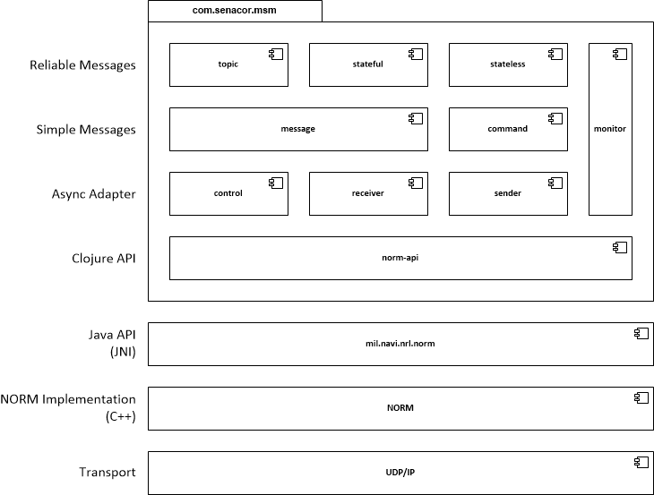

# Introduction to com.senacor.msm.norm

## Architecture

The lowest level is the transport layer offered by UDP/IP sockets providing non.reliable data transmission.
The next layer is the NORM library, a C++ implementation of the NORM protocol. A Java JNI wrapper provides
an object abstraction at the Java level.

_com.senacor.msm_ starts above this level by wrapping the Java API into a Clojure API 
(which btw. gets rid of the objects and creating a limited functional flavour).
The Async Adapter is made up of the three namespaces: sender and receiver map clojure.core.async channels to
NORM streams. The channels accept and return byte arrays containing the NORM payload.
The control namespace deals with NORM's event-loop mapping it to another async _control_ channel which
is consumed by the sender and receiver.
The message namespace creates and parses message objects and takes care of the fact that a serialized
message object may have been split into several byte arrays (or UDP packets as we get down to the
protocol layer) during transmission. While sending is simply done by serializing the message into a byte
array, receiving consumes a channel of byte arrays and fills another channel of messages.
The monitor namespace creates and updates JMX mbeans for status reporting on data transmission.

At the top there are three modes of transport:

1. **Topic** refers to the JMS concept of a Topic. A message is sent by one or more producer and
it is delivered to all consumers that have subscribed to this particular message label.
2. **Stateful** is more Queue-like. A message is sent by one or more message producers and received
by exactly one active consumer. In case this consumer fails processing is taken over by one of
the passive consumers. This mode should be used when message processing updates some sort of local
state.
3. **Stateless** is also providing truely JMS-queue-like abstraction. All messages are received by
all consumers and each message is guaranteed to be delivered and processed by exactly one of them. 
When a consumer fails while it is processing a message the message is resent to another consumer.

An important difference to JMS is the lack of persistent storage. Since there is no central server
there is also no storage of undelivered messages. When all consumers fail simultaneously messages will
be lost. This is an intended feature of MSM and part of the trade-off between reliability and
performance and throughput.

Message distribution modes are implemented on the receiver side. One of the goals of asynchronous
communication is to make the sender unaware of the receivers. Therefor the sender does not know
how many receivers have subscribed to a particular channel, if they are stateful or stateless
or if there are no receivers at all.

### Stateless receiver

Stateless communication is implemented on the receiver side. Each stateless receiver
posts NORM command messages with containing it's node id (which is unique in a session) to
all receivers on this session. Each receiver updates a map of active receivers and sets an
expiry date for this receiver. Once the receiver has expired (which happens automatically
unless it has been renewed by a new posting) the receiver is removed from the map.

#### How does a receiver find out if it has to process a particular message?

Each receiver maintains a list of co-receivers which is supposed to be the same (incl.
order)for all participants.

    (if (= (mod (hashCode uuid) (count receivers)) my-index) 0)
      (process-message message)
      (buffer-message)
      
The message is going to be processed by the respective receiver if the UUID hash modulo
number of receivers is equal to the receiver's index. Otherwise the message will be buffered
for reprocessing.

#### How do we handle receiver failure?

When the membership is not renewed it will expire and will be removed from the receivers table.
In this case the remaining receivers reviews the buffer and reprocesses
all messages he is now responsible for.

